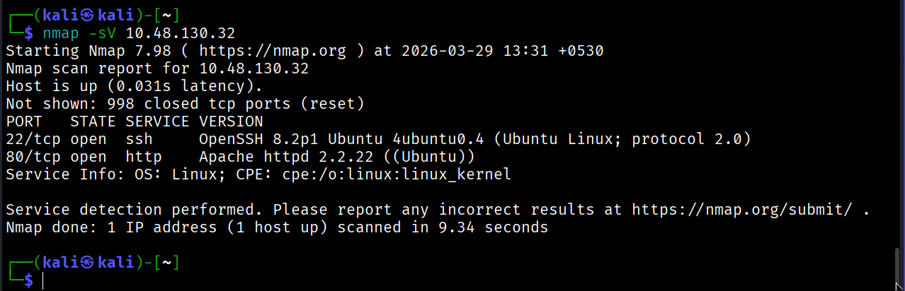
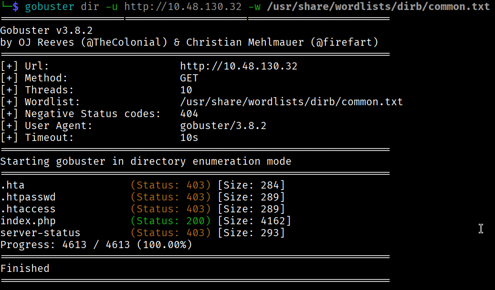
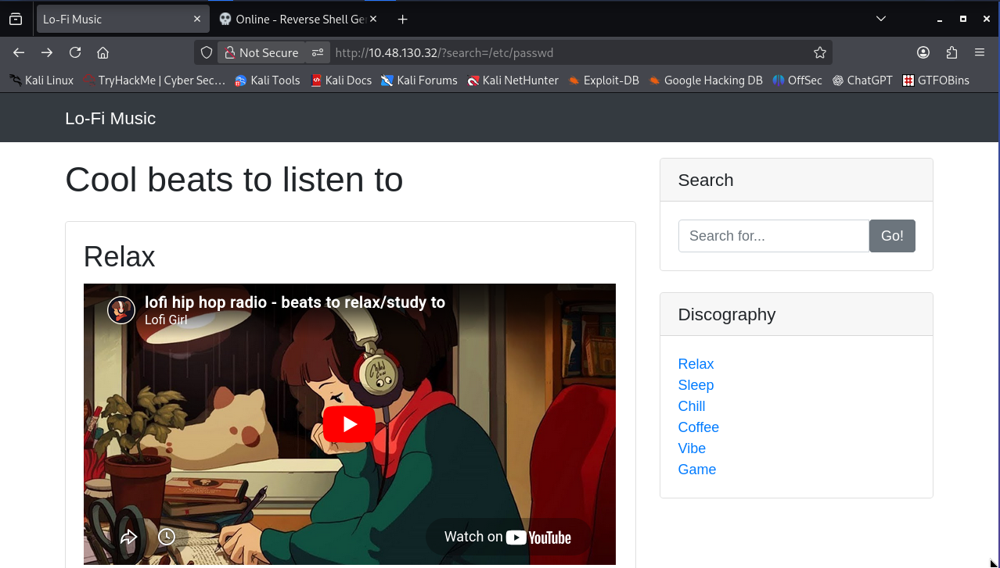
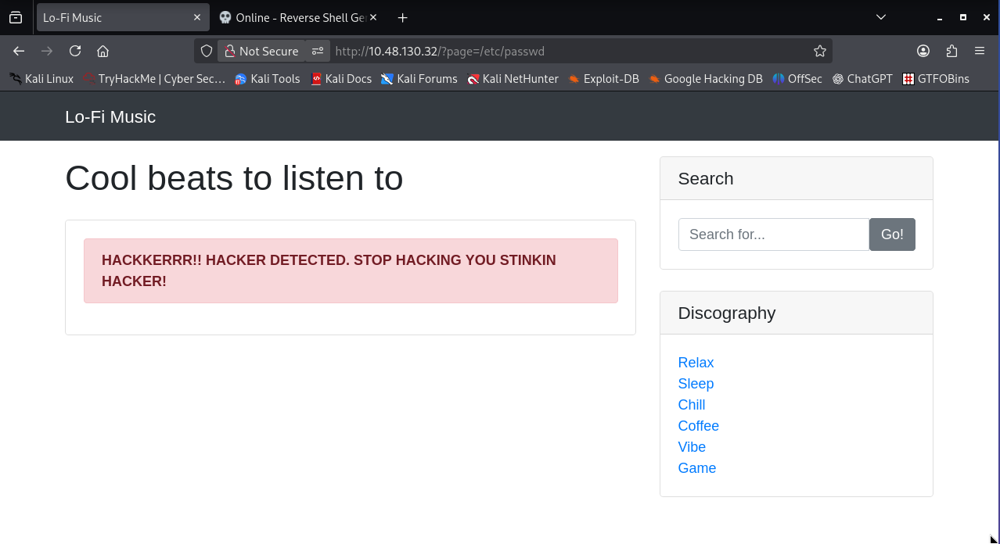
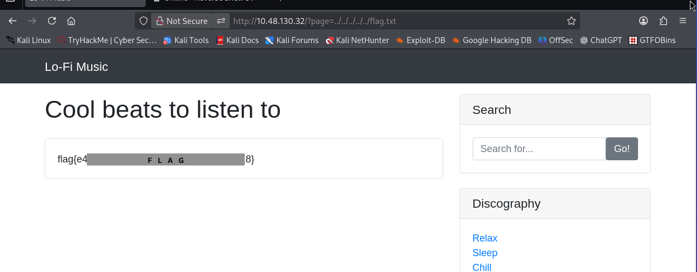

Room Link: [Lo-Fi](https://tryhackme.com/room/lofi)

NMAP Scan:



Gobuster Scan:



let's visit the web page and find the vulnerability.

So as a hint it is given that we have LFI in this room. but where?

```shell
http://10.48.130.32/?page=relax.php
```
OR
```shell
http://10.48.130.32/?search=
```


this returns the same page.



we got it.

```shell
../../../../flag.txt
```


