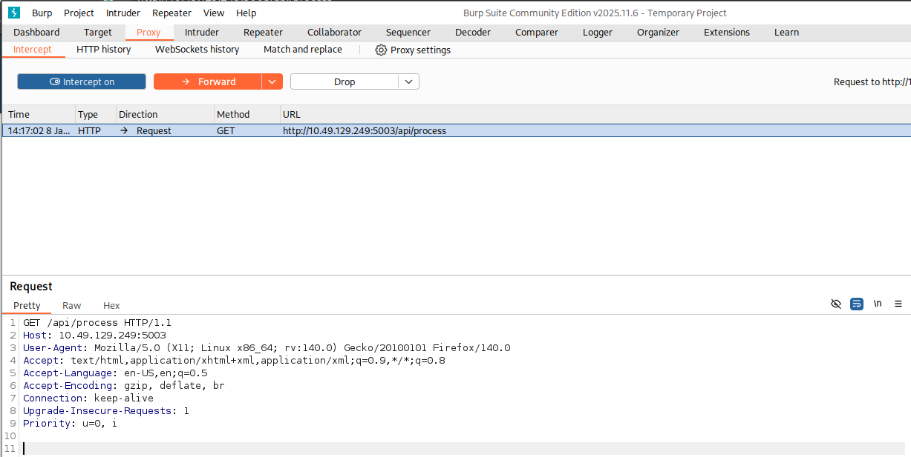
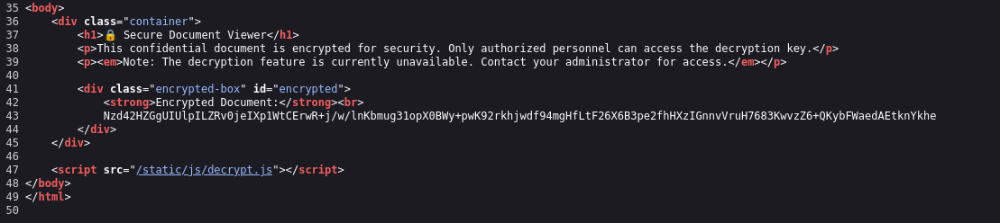

## These Design Flaws Contain:
	1. AS02: Security Misconfigurations
	2. AS03: Software Supply Chain Failures
	3. AS04: Cryptographic Failures
	4. AS06: Insecure Design

## AS02: Security Misconfigurations

Happens when system, servers or applications are deployed with unsafe defaults, incomplete settings, or exposed services. These are not code bugs but mistakes in how the environment, software or network is set up. They create easy entry points for attackers.

even a small misconfig can expose sensitive data, enable priv esc, of give foothold to the attackers. Modern applications rely on complex stacks, cloud services, and third-party APIs. A single exposed admin panel, an open storage bucket, or misconfigured permissions can compromise the entire system.

### Example:

In 2017, Uber exposed a backup AWS S3 bucket with sensitive user dta, including driver and rider information, because the bucket was publicly accessible. Attackers could download can directly without needing creds.

### Common Patterns
- Default credentials or weak passwords left unchanged
- Unnecessary services or endpoints exposed to the internet
- Misconfigured cloud storage or permissions (S3, Azure Blob, GCP buckets)
- Unrestricted API access or missing authentication/authorisation
- Verbose error messages exposing stack traces or system details
- Outdated software, frameworks, or containers with known vulnerabilities
- Exposed AI/ML endpoints without proper access controls
### How To Prevent It
- Harden default configurations and remove unused features or services
- Enforce strong authentication and least privilege across all systems
- Limit network exposure and segment sensitive resources
- Keep software, frameworks, and containers up to date with patches
- Hide stack traces and system information from error messages
- Audit cloud configurations and permissions regularly
- Secure AI endpoints and automation services with proper access controls and monitoring
- Integrate configuration reviews and automated security checks into your deployment pipeline
# FLAG 1 : Verbose Error Message

The verbose error is something which gives your the leaks in the error message and it is an application security misconfiguration, when a developer makes it easy by providing detailed verbose errors in the error message.


capture the request with the burp suite and send it to the repeater. 

you can put random input in `/api/user/<random string>` , and the error shows the verbose error FLAG.

Ans. THM{V3RB0S3_3RR0R_L34K}


## AS03: Software Supply Chain Failures.


Software supply chain failures happen when applications rely on components, libraries, services, or models that are compromised, outdated, or improperly verified.

The vulnerability does not depend on the code but the software it is dependent on. Attackers can exploit these weak links and inject malicious codes, bypass security, or steal sensitive data.

## **Common Patterns**

- Using unverified or unmaintained libraries and dependencies
- Automatically installing updates without verification
- Over-reliance on third-party AI models without monitoring or auditing
- Insecure build pipelines or CI/CD processes that allow tampering
- Poor license or provenance tracking for components
- Lack of monitoring for vulnerabilities in dependencies after deployment
### **How To Protect The Supply Chain**

- Verify all third-party components, libraries, and AI models before use
- Monitor and patch dependencies regularly
- Sign, verify, and audit software updates and packages
- Lock down CI/CD pipelines and build processes to prevent tampering
- Track provenance and licensing for all dependencies
- Implement runtime monitoring for unusual behaviour from dependencies or AI components
- Integrate supply chain threat modelling into the SDLC, including testing, deployment, and update workflows

## FLAG 2


Capture /api/process with burpsuite.

change `GET` to `POST`.


And we get this, this might be the hint that we have to add content-type as application/json and then process the request.

```
from flask import Flask, render_template, request, jsonify
import sys
import os

# Import from local unverified library
sys.path.insert(0, os.path.join(os.path.dirname(__file__), 'lib'))
from vulnerable_utils import process_data, format_output, debug_info

app = Flask(__name__)

@app.route('/')
def index():
    return render_template('index.html')

@app.route('/api/process', methods=['POST'])
def process():
    """Process user input using third-party library"""
    try:
        data = request.json.get('data', '')
        if not data:
            return jsonify({'error': 'Missing data parameter'}), 400
        
        # Check for debug mode 
        if data == 'debug':
            return jsonify(debug_info())
        
        processed = process_data(data)
        formatted = format_output(processed)
        
        return jsonify({
            'result': formatted,
            'status': 'success'
        })
    except Exception as e:
        return jsonify({'error': str(e)}), 500

@app.route('/api/health')
def health():
    """Health check endpoint"""
    return jsonify({
        'status': 'healthy',
        'version': '1.0.0'
    })

if __name__ == '__main__':
    app.run(host='0.0.0.0', port=5000, debug=True)

```

this is the code give in the task file, if we check the line we have to use the value `"data": "debug"` 


so as you can see we used `Content-Type = application/json` and `"data":"debug"`

Ans. THM{SUPPLY_CH41N_VULN3R4B1L1TY}

## AS04: Cryptopgraphic Failures

These types of failures happen when cryptography is used incorrectly or not at all. This includes weak algos, hard-coded keys, or unencrypted sensitive data. These let attackers access the sensitive data.

### Common Patterns.
- Using deprecated or weak algorithms like MD5, SHA-1, or ECB mode
- Hard-coded secrets in code or configuration
- Poor key rotation or management practices
- Lack of encryption for sensitive data at rest or in transit
- Self-signed or invalid TLS certificates
- Using AI/ML systems without proper secret handling for model parameters or sensitive inputs

### **How To Prevent It**

- Use strong, modern algorithms such as AES-GCM, ChaCha20-Poly1305, or enforce TLS 1.3 with valid certificates
- Use secure key management services like Azure Key Vault, AWS KMS, or HashiCorp Vault
- Rotate secrets and keys regularly, following defined crypto periods
- Document and enforce policies and standard operating procedures for key lifecycle management
- Maintain a complete inventory of certificates, keys, and their owners
- Ensure AI models and automation agents never expose unencrypted secrets or sensitive data
- The web application in this room contains a weakness of this type for you to explore.


we can see the encrypted text here.
`Nzd42HZGgUIUlpILZRv0jeIXp1WtCErwR+j/w/lnKbmug31opX0BWy+pwK92rkhjwdf94mgHfLtF26X6B3pe2fhHXzIGnnvVruH7683KwvzZ6+QKybFWaedAEtknYkhe`



he we can see that in the source code there is a file name `decrypt.js`

here we can see the encryption used here is `ECB` and the secret-key is `my-secret-key-16`

so we can use [Online ECB Decryption](https://www.devglan.com/online-tools/aes-encryption-decryption)


And here we go, we got out flag.

Ans. THM{CRYPTO_FAILURE_H4RDCOD3D_K3Y}


## AS06: Insecure Design


It happens when application logic is flawed or architecture is built into a system from the start. These flaws stem from skipped threat modelling, no design requirements or reviews, or accidental errors.


we can't fix the insecure design flaws, It's built into the workflow, logic and trust boundaries. Fixing it means rethinking how systems, and now AI, make decisions. 

### **Common Insecure Designs In 2025**

- Weak business logic controls, like recovery or approval flows
- Flawed assumptions about user or model behaviour
- AI components with unchecked authority or access
- Missing guardrails for LLMs and automation agents
- Test or debug bypasses left in production
- No consistent abuse-case review or AI threat modelling 


so here we can see the, it says the must be downloaded on mobile. 
but obviously its and insecure design flaw and you can see the app has private messages

capture the `/api/users/` request in the burpsuite.


so here we can see some users and their role.

we will try another request to fetch the admin messages `/api/messages/admin`

here you can see we got the flag as due to insecure design, some backend api endpoints are left open to be traversed.

Ans. THM{1NS3CUR3_D35IGN_4SSUMPT10N}


### Conclusion 
Security design failures across AS02 Security Misconfigurations, AS03 Software Supply Chain Failures, AS04 Cryptographic Failures, and AS06 Insecure Design all come from the same root cause: weak foundations.

You cannot add security at the end and expect it to work. Strong systems start with clear security requirements, realistic threat assumptions, controlled configurations, vetted dependencies, and sound cryptographic choices.

Treat defaults with suspicion, treat every dependency as a potential risk, and keep design simple enough to reason about. Get the design right early, and you avoid a long future of preventable incidents.
